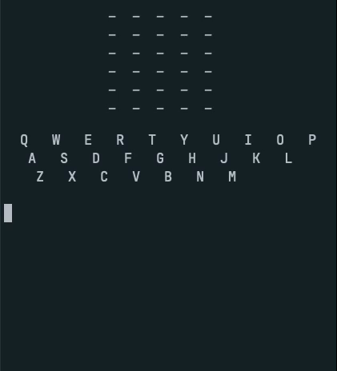

# Rurdle

Very basic wordle clone for the terminal, written in Rust... for no reason at all other than to get familiar with Rust. It uses no external libraries at the moment. It uses simple ascii escape sequences to clear the current screen, and set colors. If you don't have a terminal that supports extended chars (UTF-8) for emojis, then it's going to render the share grid oddly. 



### Quick run:
```shell
cargo run --bin rurdle
```

### Build for release, as Cargo users should know:
```shell
cargo build --release
```

### Binaries in:

```shell
./target/release/rurdle
./target/debug/rurdle
```


